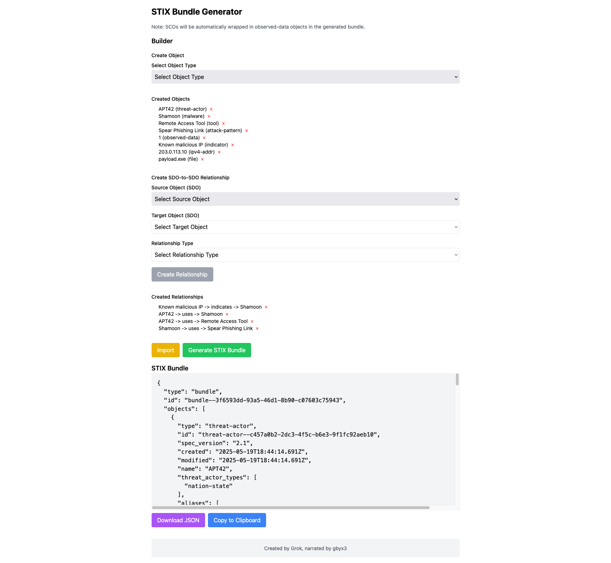

# STIX Bundle Generator

 <!-- Placeholder for screenshot -->

The STIX Bundle Generator is a web-based application for creating, importing, editing, and exporting STIX 2.1 bundles containing STIX Cyber-observable Objects (SCOs). Built with React and Tailwind CSS, it provides a user-friendly interface for cybersecurity professionals to manage threat intelligence data in the Structured Threat Information Expression (STIX) format.

## Table of Contents
- [Purpose](#purpose)
- [Features](#features)
- [Installation](#installation)
- [Usage](#usage)
- [Contributing](#contributing)
- [License](#license)
- [Acknowledgments](#acknowledgments)

## Purpose
The STIX Bundle Generator simplifies the process of working with STIX 2.1 bundles, enabling users to:
- Create SCOs (e.g., `email-addr`, `network-traffic`, `file`) with customizable fields.
- Import existing STIX bundles to view and edit SCOs.
- Export bundles for use in threat intelligence platforms.
- Visualize and manage SCOs through an intuitive interface.

This tool is ideal for threat analysts, incident responders, and developers building STIX-compatible applications.

## Features
- **Supported SCO Types**: 20 STIX 2.1 SCO types, including `artifact`, `autonomous-system`, `domain-name`, `email-addr`, `email-message`, `file`, `ipv4-addr`, `ipv6-addr`, `network-traffic`, `user-account`, `x509-certificate`, and more.
- **Interactive UI**:
  - Clickable SCO chips for editing, with single-line inputs for primary and additional fields.
  - Aggregated SCO display (e.g., `user-account (2)` for multiple `user-account` SCOs).
  - Modal-based JSON import with a single "Import" button.
- **Bundle Management**:
  - Generate STIX 2.1 bundles with unique IDs and timestamps.
  - Download bundles as JSON files.
  - Copy bundle JSON to clipboard.
  - Clear all SCOs with a single button.
- **Customizable Fields**:
  - Primary fields (e.g., `value` for `email-addr`, `protocols` for `network-traffic`) with single-value submission.
  - Additional fields (e.g., `rir`, `is_multipart`, `src_ref`, `dst_ref`) with text, number, or checkbox inputs.
  - Special handling for `x509-certificate` hashes (MD5, SHA-1, SHA-256, SHA-512).
- **Accessibility**: Non-selectable "Select SCO Type" placeholder and ARIA labels for buttons.
- **Styling**: Responsive design using Tailwind CSS.
- **Limitations** (current version):
  - May produce duplicate `email-addr`, `ipv4-addr`, `ipv6-addr` SCOs during import.
  - `from_ref`, `src_ref`, `dst_ref` display IDs (e.g., `email-addr--55555555-...`) instead of resolved values.
  - Potential runtime errors (`openModal`, `downloadBundle`) due to direct `onClick` handlers.

## Installation
The STIX Bundle Generator is a single-page web application that runs in the browser, requiring no server-side setup.

### Prerequisites
- A modern web browser (e.g., Chrome, Firefox, Edge).
- No additional software or dependencies are required, as all libraries are loaded via CDN.

### Steps
1. **Clone or Download**:
   ```bash
   git clone https://github.com/your-username/stix-bundle-generator.git
   ```
   Alternatively, download the `index.html` file from the repository.

2. **Open in Browser**:
   - Open `index.html` directly in a web browser (e.g., double-click the file or use `file://` protocol).
   - No local server is required, as the app uses CDN-hosted dependencies (React 18.2.0, ReactDOM 18.2.0, Babel Standalone 7.22.9, Tailwind CSS).

3. **Optional: Serve Locally** (for development):
   - Use a local server to avoid CORS issues with file-based access:
     ```bash
     npx http-server
     ```
   - Navigate to `http://localhost:8080/index.html`.

## Usage
1. **Launch the Application**:
   - Open `index.html` in your browser.
   - The interface displays a "Select SCO Type" dropdown and an "Import" button.

2. **Create an SCO**:
   - Select an SCO type (e.g., `user-account`).
   - Enter the primary field value (e.g., `account_login: user1`) in the single-line input.
   - Fill in additional fields (e.g., `user_id`, `account_type`) if applicable.
   - Click "Add SCO" to add the SCO to "Added SCOs".
   - Repeat to add multiple SCOs; chips show aggregated counts (e.g., `user-account (2)`).

3. **Edit an SCO**:
   - Click a chip in "Added SCOs" (e.g., `user-account (2)`) to edit the last SCO of that type.
   - Update fields and click "Update SCO" or "Cancel".

4. **Remove an SCO**:
   - Click the `×` button on a chip to remove the last SCO of that type.

5. **Import a Bundle**:
   - Click "Import", paste a STIX 2.1 bundle JSON, and click "Submit".
   - SCOs appear as chips in "Added SCOs" (note: duplicates may occur).

6. **Generate and Export**:
   - Click "Generate STIX Bundle" to create a bundle.
   - Use "Download JSON" to save as `stix_bundle.json` or "Copy to Clipboard" to copy the JSON.
   - Click "Clear All SCOs" to reset.

### Example Bundle
```json
{
  "type": "bundle",
  "id": "bundle--11111111-1111-1111-1111-111111111111",
  "objects": [
    {
      "type": "email-addr",
      "id": "email-addr--55555555-aaaa-5555-aaaa-555555555555",
      "spec_version": "2.1",
      "value": "user@example.com"
    },
    {
      "type": "email-message",
      "id": "email-message--66666666-aaaa-6666-aaaa-666666666666",
      "spec_version": "2.1",
      "is_multipart": false,
      "date": "2023-01-01T12:34:56Z",
      "from_ref": "email-addr--55555555-aaaa-5555-aaaa-555555555555",
      "subject": "Test Email"
    }
  ]
}
```

## Contributing
Contributions are welcome! To contribute:
1. **Fork the Repository**:
   ```bash
   git fork https://github.com/your-username/stix-bundle-generator.git
   ```
2. **Create a Branch**:
   ```bash
   git checkout -b feature/your-feature
   ```
3. **Make Changes**:
   - Address known issues (e.g., duplicate SCOs, unresolved `from_ref`/`src_ref`/`dst_ref`, runtime errors).
   - Add features (e.g., email/IP validation, confirmation for "Clear All SCOs").
   - Update `CHANGELOG.md` with your changes.
4. **Test Locally**:
   - Ensure `index.html` runs without errors.
   - Test with sample bundles.
5. **Submit a Pull Request**:
   - Push your branch and create a PR with a clear description of changes.
   - Reference relevant issues or artifact versions.

### Known Issues
- Duplicate `email-addr`, `ipv4-addr`, `ipv6-addr` SCOs during import.
- `from_ref`, `src_ref`, `dst_ref` display IDs instead of values.
- Potential runtime errors (`openModal`, `downloadBundle`) due to direct `onClick` handlers.

## License
This project is licensed under the MIT License. See the [LICENSE](LICENSE) file for details.

## Acknowledgments
- Created by Grok, narrated by gbyx3.
- Built with [React](https://reactjs.org/), [Tailwind CSS](https://tailwindcss.com/), and [Babel](https://babeljs.io/).
- Inspired by the need for accessible STIX 2.1 tools in cybersecurity.

---
*Last Updated: May 13, 2025*